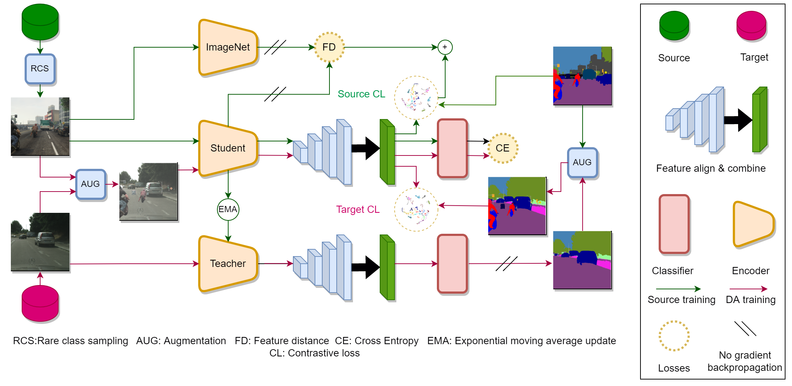

# CLUDA : Contrastive Learning in Unsupervised Domain Adaptation for Semantic Segmentation



## Please download the following datasets from the corresponding links and save them to `./data` folder

**Cityscapes:** Download leftImg8bit_trainvaltest.zip and
gt_trainvaltest.zip from [here](https://www.cityscapes-dataset.com/downloads/)
and extract them to `data/cityscapes`.

**GTA:** Download images, labels from
[here](https://download.visinf.tu-darmstadt.de/data/from_games/) and extract
them to `data/gta`.

**Synthia:** Download SYNTHIA-RAND-CITYSCAPES from
[here](http://synthia-dataset.net/downloads/) and extract it to `data/synthia`.

## After saving the dataset, Please make sure that your directory tree looks exactly like following chart:

```none
CLUDA
├── ...
├── data
│   ├── cityscapes
│   │   ├── leftImg8bit
│   │   │   ├── train
│   │   │   ├── val
│   │   ├── gtFine
│   │   │   ├── train
│   │   │   ├── val
│   ├── gta
│   │   ├── images
│   │   ├── labels
│   ├── synthia
│   │   ├── RGB
│   │   ├── GT
│   │   │   ├── LABELS
├── ...
```

## Testing & Predictions

For testing, please replace `220609_1430_gtaHR2csHR_hrda_s1_5fbff.json` with the json file generated in the output folder of your experiment and run the following command:

```shell
sh test.sh <output dir name>
```

## Training

For running the main experiment please do the following:

```shell
./run_train.sh <name of the experiments (any name of your choice)>
```

## Acknowledgements

We have used code from following open-source repositories. We thank the authors for making their work public. 

* [HRDA](https://github.com/lhoyer/HRDA)
* [DAFormer](https://github.com/lhoyer/DAFormer)
* [MMSegmentation](https://github.com/open-mmlab/mmsegmentation)
* [SegFormer](https://github.com/NVlabs/SegFormer)
* [DACS](https://github.com/vikolss/DACS)
* [Exploring Cross-Image Pixel Contrast for Semantic Segmentation](https://github.com/tfzhou/ContrastiveSeg)
